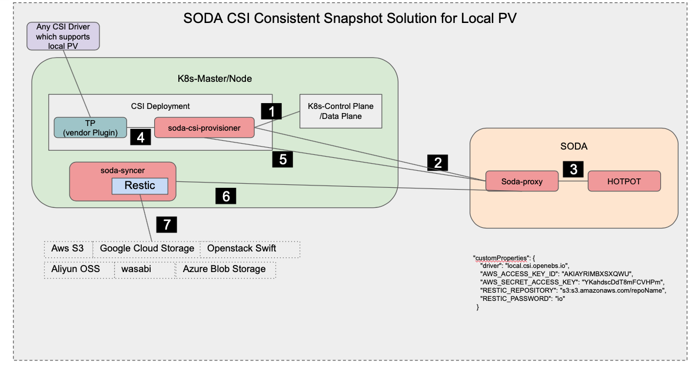

# Soda-syncer

Soda-syncer is an experimental feature for syncing the meta-data from different Platforms and adding features to SODA NBP Plugins.

Soda-syncer will be providing the following features :- 
 - [x] Consistent Snapshot to CSI Plugins
 - [ ] CSI Meta-data sync between Soda and K8s


*Note*: This is an experimental project and is not ready to be used in production.

### Consistent Snapshot Solution for CSI Plugins
Consistent Snapshot is considered as snapshots which are taken at regular intervals and pushed to cloud for DR Solutions.   
Consistent snapshot is provided by few CSI Plugin Drivers, but most of them lack this feature, Soda provides this solution for CSI Plugin Drivers which gives local PV. The local PV is backed up by soda-syncer at regular interval as configured and backed up to the cloud of your choice.
Soda leverages the Soda profile and [CSI Plug-N-Play](../csi-plug-n-play/) design to configure the snapshot policy and does the backup independently without platform support, currently this solution is available for K8s, and it doesn't require any operator/crd to add on this feature to existing CSI plugins.



Flow :
 1. soda-csi-provisioner watches for the sc,pvc & pv objects  
 2. soda-csi-provisioner fetches the profile details from [soda-proxy](https://github.com/sodafoundation/nbp/tree/master/csi-plug-n-play/sidecars/soda-proxy)   
 3. soda-proxy connects to soda-api server with proper authentication to get the profile details.
 4. Using the profile details soda-csi-provisioner picks the backend the CSI driver and provisions the volume.
 5. soda-csi-provisioner sends the consistent snapshot request to soda-proxy.
 6. soda-proxy gets the Profile detalis and fetches the snapshot policy and sends request to soda-syncer at current node to backup.
 6. soda-syncer at configured intervals invokes restic to do the cloud backup. 


### Quick Start Guide  
To deploy the above solution you need to ensure the below pre-requisite
 - Kubernetes 1.17+  is installed
 - CSI drivers are installed using soda [csi-plug-n-play mechanism](https://docs.sodafoundation.io/guides/integration-guides/csi-integration/soda-csi-pnp/).
 - Soda J release or above is installed (at least hotpot component)
 - [Restic](https://restic.readthedocs.io/en/latest/020_installation.html) is installed on all the K8s nodes.  

Please follow the below steps to Build and run the soda-syncer on all the k8s node.

``` 
go get github.com/sodafoundation/nbp

cd $GOPATH/src/github.com/sodafoundation/nbp/soda-syncer

go build -o soda-syncer cmd/snapshot.go
```

To start the process
```
./scripts/start.sh
```
This will by default start the soda-syncer on 0.0.0.0:50030

Cleanup
```
./scripts/stop.sh
```