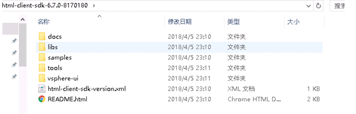
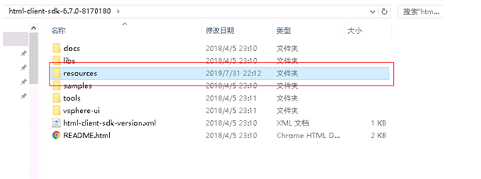

# OpenSDS NGC Plugin

## V1.0.0 Compilation Guide


## Content

- 1 Introduction
   - 1.1. Purpose
- 2 Compile Environment
   - 2.1. Hardware
   - 2.2. Software
- 3 Compilation dependencies
   - 3.1 Configuring the JAVA Environment
   - 3.2 Configuring the Ant Environment
   - 3.3 Configuring the Maven Environment
   - 3.4 Configuring the vSphere Client SDK Environment
   - 3.5 Configuring Flash Builder Environment
- 4 Source Code Compilation
   - 4.1 NGC Plugin
- 5 FAQ


OpenSDS NGC Plugin V1.0.0 Compilation Guide

Keywords： NGC

Abstract: This article gives a detailed description of the storage NGC plugin compilation

Remarks：

## 1 Introduction

This document mainly describes the compilation of the OpenSDS NGC Plugin V1.0.0 version.

### 1.1. Purpose

Through the description of the compilation method, it is convenient for future development and test to perform

corresponding compilation operations, and it is also convenient for later maintenance and correction.

## 2 Compile Environment

### 2.1. Hardware

 4G memory

 CPU 2.3GHz

 10G available disk space

### 2.2. Software

 Windows 7 Professional, 64-bit operating system
 JDK 1.8.0_

 ANT 1.9.

 Maven 3.5.

 Flash Builder 4.

```
word description
NGC Next Generation Client
```

## 3 Compilation dependencies

### 3.1 Configuring the JAVA Environment

```
Install JDK by following instructions provided on the Oracle official website.
```
### 3.2 Configuring the Ant Environment

```
Install ANT by following instructions provided on the Apache official website
```
### 3.3 Configuring the Maven Environment

```
Install Maven by following instructions provided on the Apache official website.
```
### 3.4 Configuring the vSphere Client SDK Environment

```
Step 1 Download the vSphere Client SDK Development Kit (https://code.vmware.com/web/sdk/6.7/client) from
the vMware website.
```
```
Step 2 Extract the downloaded vSphere Client SDK to a local directory.
```


```
Step 3 Set the system environment variable VSPHERE_SDK_HOME. The variable value is the directory of the
decompressed SDK package.
```
```
Step 4 In order to support vSphere Web Client Client (Flex ), please also download the vSphere Clint SDK
Development Kit (https://code.vmware.com/web/sdk/6.7/web-client) from the vMware website.
```
```
Step 5 Extract the downloaded vSphere web Client SDK and copy the resources folder to
VSPHERE_SDK_HOME directory.
```



### 3.5 Configuring Flash Builder Environment

```
Step 1 From the Adobe Web site at http://www.adobe.com/devnet/flex/flex-sdk-download.html, download the
Adobe Flex 4.6 SDK.
```
```
Step 2 Extract the contents of the SDK distribution file on your development machine.
```
```
Step 3 Set up the FLEX_HOME environment variable to point to the location of the Adobe Flex SDK on your
machine.
```
```
Step 4 Go to the <your_flex_sdk>/frameworks/libs/player directory and verify that you have a 11.5 folder
that contains the playerglobal.swc file.
```
```
a) If the folder is not present in your Adobe Flex SDK, download the missing file from the following location
http://fpdownload.macromedia.com/get/flashplayer/installers/archive/playerglobal/playerglobal11_5.swc
```
```
b) Rename the downloaded file to playerglobal.swc.
```
```
c) Create a 11.5 folder under the <your_flex_sdk>/frameworks/libs/player directory and place the renamed
file there.
```
## 4 Source Code Compilation

### 4.1 NGC Plugin

```
Step 1 Download the OpenSDS Northboud Plugin project code to a local directory.
```
```
Step 2 Enter the vmware/ngc directory and run ngc_package.bat in the Windows environment
(ngc_package.sh in the Linux environment).
```
```
Step 3 After the compilation is completed, the ZIP package of the NGC Plug-in plugin will be generated in the
release directory.
```
## 5 FAQ